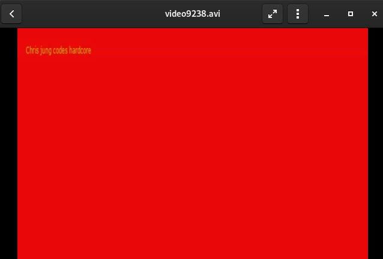

# Video Encoder FFMPEG
## Noah Malhi

Readme with screenshots due to Amazon account issue.

For this hw, I utilized the twitter api. The format of the video is the image and then the tweet in which the image came from. For the web application portion I used Flask.

To run the application locally, run in the command line: env FLASK_APP=backend.py flask run
Now one can access the app locally.

To use the web application. From the webpage enter up to four usernames into the textboxes. On submit it will develop the videos and install them into a zipfolder for the user to access.

  

The processes of converted text to images was threaded. From using the linux 'time' command' I was able to lower run time by about .2 in most cases for total run time.

For multiprocessing I used "Processes" imported from multiprocessors. I was at most able to execute 6 processes cleanly. I made a lists of processes and had a four loop to call the main 6 times. The made processes were added to the list and after all the processes were made thier was a proccess join to wait for all the proccesses to complete before the program ended.
With the web app, I decided to just use four twitter handles at most. I thought this would be a big enough load without running into any errors while trying to max out with 6.

The interface is very simple. There is a table to enter up to four usernames. Once you type in the usernames, press submit and a post action will be executed thus making the videos. This runs ffmpeg and tweepy.
  

The separate videos were saved as video(process number).avi. Each process number was attained by using getpid().

The way the web application utilizes flask and is run through backend.py. When users are inputed and submitted a post method is used to request the usernames and run the twitter to video program from the last homework. The made videos are then accessible to the user as they are downloaded as a zip file.

  

After you click on the zip you have an option to extract the videos which are labled as video(PID).avi.

  

The following image is a screenshot of an example tweet from a avi video made from the web app.

  
